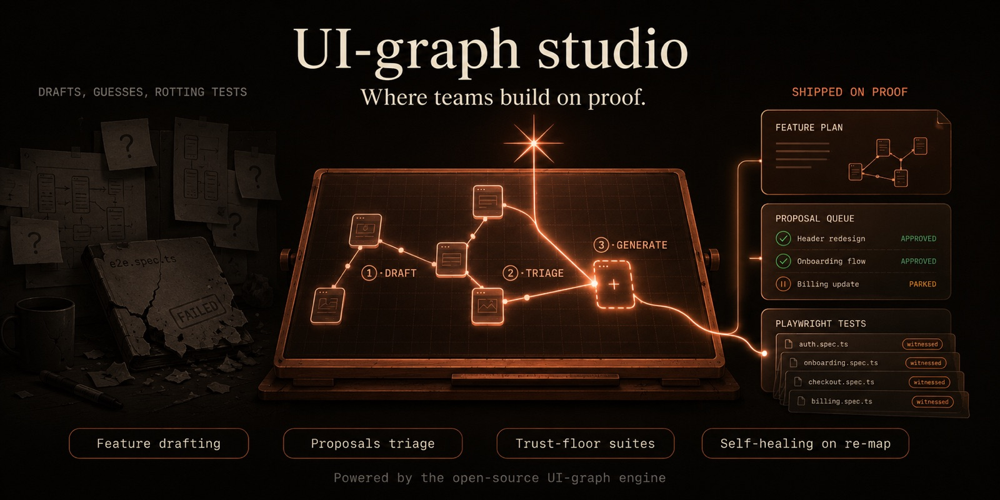
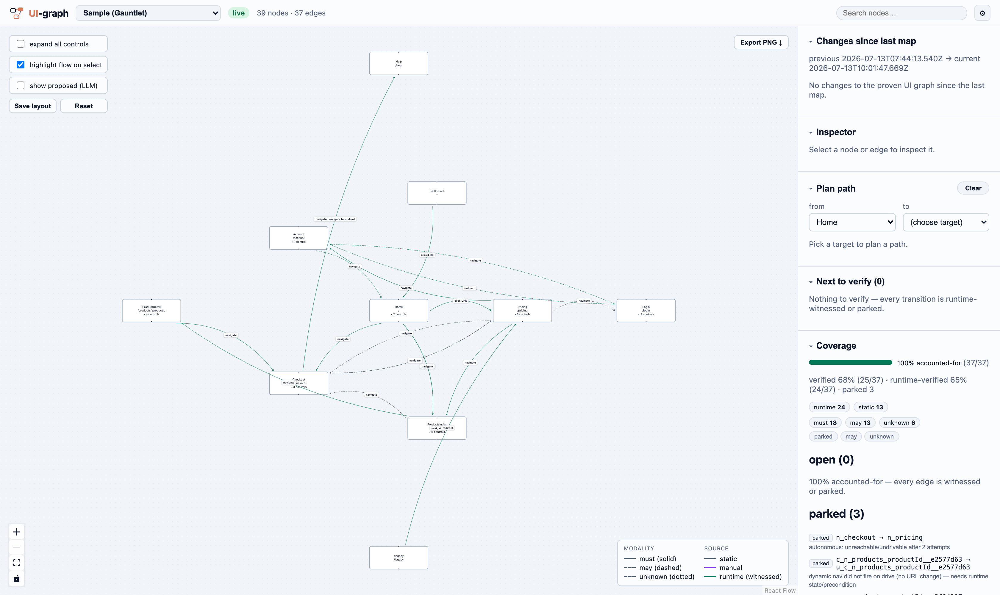
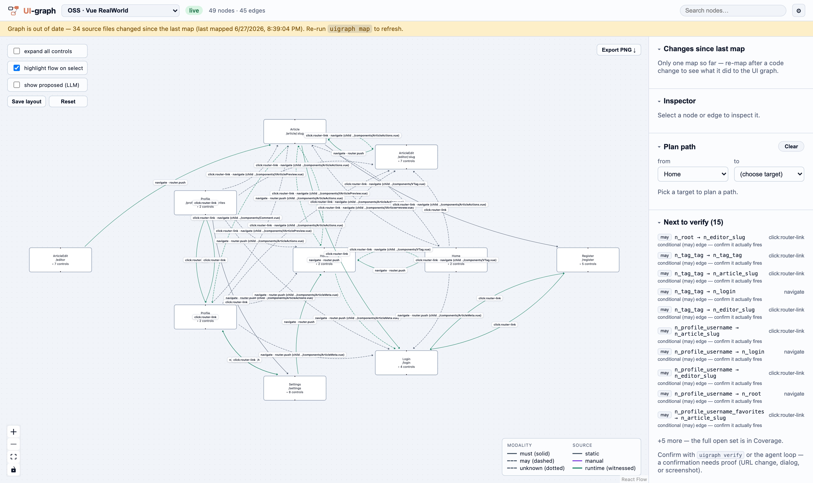

<p align="center"></p>

<h1 align="center">UI-graph</h1>

<p align="center"><b>Your app generates its own verified behavioral map.</b><br/>
<i>React · Vue · Angular · Next.js — screens as nodes, <code>(event, guard, effect)</code> transitions as edges.</i></p>

<p align="center">Tests, docs, agents, and impact analysis are all views over one graph — and every edge says how much you can trust it.</p>

<p align="center">
  
  
  
  
  
  
</p>

<p align="center"></p>

---

> *Your agent re-derives your app's navigation from source on every session — and a graph it guesses today can disagree with the one it guesses tomorrow. UI-graph computes the map once per commit, deterministically, then makes the LLM's additions earn their way in with runtime proof. The moat is not the word "map". It's the word <b>verified</b>.*

## Features

> [!NOTE]
> The core is **model-free**: no API key, no bundled LLM. Your coding agent (Claude Code, Cursor, Copilot) connects over MCP and brings its own model — the graph works offline and in LLM-restricted CI.

| | |
| --- | --- |
| **Deterministic extraction** | ts-morph static analysis of react-router v5/v6/data-router, vue-router, Angular Routes, and Next.js file routes — every edge carries a `file:line` witness |
| **Proof-gated verification** | `report_observation(confirmed)` requires evidence (URL change, asserted dialog, screenshot on disk) + provenance, or it is rejected. A hallucinated confirmation cannot enter the graph |
| **Trust tiers on every edge** | `witnessed > proven > asserted > llm-verified > proposed > unknown` — projected on read, so an agent always knows how far to lean |
| **The Tier-2/3 loop** | The LLM proposes greedily (`propose`, quarantined), the runner drives a real browser (`uigraph verify`), and only the observation — never the guess — mints an edge |
| **Honest coverage** | `runtime-verified ⊆ verified ⊆ accounted` are never conflated; undrivable edges are parked with a written reason, and a re-map demotes stale witnesses for re-confirmation |
| **Agent-native** | 27 MCP tools + an installable agent kit (`uigraph kit install`), a one-command dashboard, Playwright spec generation, and structural + temporal graph diffs |

## Quick start

1. **Install and map your app** (adapter auto-detected from `package.json`):

   ```bash
   pnpm install && pnpm check
   pnpm --filter @uigraph/cli run uigraph -- map ~/work/your-app --controls
   ```

2. **Open the dashboard** — one command, serves UI + API and opens your browser:

   ```bash
   uigraph dash                 # all registered projects, switchable in the topbar
   ```

3. **Verify against the running app** — drive uncertain transitions in a real browser; confirmations need proof:

   ```bash
   uigraph login http://localhost:3000 --out auth.json    # log in manually once (any auth scheme)
   uigraph verify ~/work/your-app --app-url http://localhost:3000 \
     --storage-state auth.json --until-done
   uigraph verify ~/work/your-app --app-url http://localhost:3000 --all   # sweep static proofs too
   ```

4. **Connect your agent** over MCP:

   ```bash
   uigraph mcp ~/work/your-app        # stdio server for Claude Code / Cursor / Copilot
   uigraph kit install --claude       # rules + guides + the reconciliation-loop playbook
   ```

> Every workspace is a single `uigraph.db` (SQLite, no native deps) you can commit — teammates and CI read the same verified graph without re-deriving it.

<p align="center"></p>

<p align="center"><i>The bundled gauntlet sample after a verify run: 65% of transitions runtime-witnessed (green),
100% accounted — every remaining edge either proven or parked with a written reason.</i></p>

## Multiple projects

`map` auto-registers each project in `~/.uigraph/`; `dash`/`serve` without a dir serve them all, switchable in the topbar. The switcher uses opaque ids — absolute paths never leave the server.

<p align="center"></p>

<p align="center"><i>Freshness is never silent: a stale graph gets a banner, and the verify worklist ranks
exactly which conditional edges to confirm next — with the reminder that a confirmation needs proof.</i></p>

## Under the hood

Three tiers, one invariant — **no edge enters the base graph without a deterministic witness**:

| Tier | Who | What enters the graph |
| --- | --- | --- |
| **1 — static** | ts-morph extractors | route nodes + edges with `file:line` witnesses; anything unresolvable degrades honestly (`may` fan-out, `unknown` sink, soundiness note) — never a silent miss, never a guessed `must` |
| **2 — propose** | your agent's LLM | nothing. Proposals are quarantined hypotheses that land on the verify worklist — a wrong proposal costs nothing |
| **3 — verify** | Playwright runner / agent | the observation, with evidence attached. Guarded edges keep their guard (one run proves existence, not unconditionality); refuting a static `must` raises the loudest alarm the system has |

Extraction quality is enforced by an adversarial **gauntlet**: a data-router React app packing 25 common-website patterns ([examples/sample-gauntlet-react](examples/sample-gauntlet-react)), graded against 35 golden expectations on every `pnpm check` — a silent miss fails the suite.

| Package | Role |
| --- | --- |
| `@uigraph/core` | framework-agnostic IR + pure ops (validate, overlay/merge, diff, plan_path, codegen, coverage, trust tiers) |
| `@uigraph/adapter-react` | react-router **v5 + v6 + data-router** extraction |
| `@uigraph/adapter-vue` · `-angular` · `-next` | vue-router, Angular Routes, Next.js App+Pages router |
| `@uigraph/mcp` | model-free stdio MCP server, 27 tools |
| `@uigraph/cli` | `map` / `verify` / `login` / `dash` / `gen` / `diff` / `serve` / `workspace` / `mcp` |
| `apps/dashboard` | React Flow viewer: graph, coverage, freshness, verify worklist |

## Open core

This repository is the complete, MIT-licensed trust engine — nothing epistemic is paywalled. The commercial layer, **UI-graph studio** (separate private repo), adds the interactive workflow on top: scenario/feature drafting, overlay editing and proposals triage in the UI, and Playwright e2e **suite** generation from the verified graph. The single-path `uigraph gen` primitive stays here.

## Contributing

1. Fork and branch.
2. `pnpm install && pnpm check` — typecheck + tests + lint must stay green.
3. Extraction changes must keep the gauntlet at 35/35 (`pnpm exec tsx scripts/gauntlet-report.ts`); new patterns welcome — add the case *and* its golden expectation.
4. Follow the dev cycle in [docs/20-development-cycle.md](docs/20-development-cycle.md).

## License

MIT © Kane Tran — see [LICENSE](LICENSE). The research dossier behind the design lives in [docs/ui-graph-dossier-final-en.md](docs/ui-graph-dossier-final-en.md).
